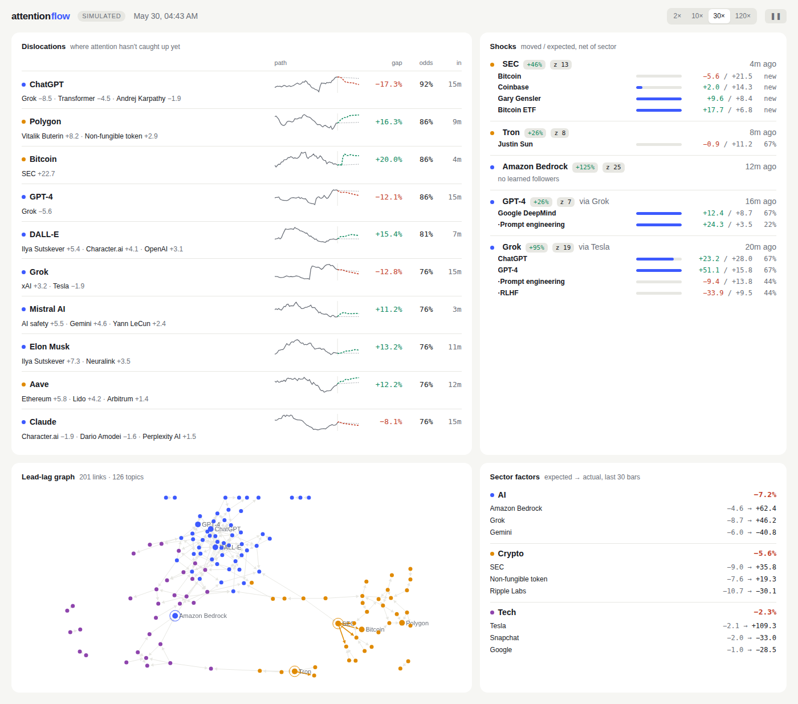

# attention flow

A streaming engine that learns how attention moves between topics, then flags the ones that haven't caught up yet.

When OpenAI spikes, ChatGPT tends to follow a few minutes later, and Sam Altman after that. This engine finds those lead-lag links on its own, estimates where each topic's attention *should* be given what its leaders already did, and says how sure it is and how long the catch-up should take.



## How it works

```
events ─► bar clock ─► sector factors ─► per-topic forecasts ─► lead-lag search ─► graph edits
                                                     │                                   │
                                                     └──────── H-bar forecast ◄──────────┘
                                                                   │
                                                  dislocations · shocks · confidence
```

1. **Candidates.** Names, tags and Wikipedia text pick which pairs are worth testing. 147 topics → 1,076 pairs instead of 10,731.
2. **Sector factors.** A shared AI / crypto / tech attention factor, so "everything in AI went up" doesn't look like a lead-lag link.
3. **Lead-lag search.** For every candidate pair and lag, a running correlation between the leader's move and the follower's *forecast error*. Testing on errors means a link only counts if nothing already explains it.
4. **Graph edits.** Links are added when significant and dropped when the follower's model stops needing them, or when their predicted effect keeps failing to show up.
5. **Forecast.** Every topic is projected H bars ahead through the graph. The gap between that path and a plain fade-back path is the **dislocation**.
6. **Shocks.** Bursts are pushed through the graph to predict who moves next, by how much and when.

Everything updates online, once per bar. The same code runs live and in replay. Details in [docs/DESIGN.md](docs/DESIGN.md).

## Results

Attention data has no answer key, so the engine is scored on a simulator that plants one: known links, lags, sector factors, shocks, and a regime change halfway through. Every number is out of sample, and the oracle is a forecaster that knows the planted model.

| | 2 weeks, minute bars | 90 days, hourly (3 seeds) |
|---|---|---|
| Links found / links that are real | 85% / 92% | 60–68% / 86–88% |
| Lag correct (±1 bar) | 100% | 99–100% |
| Share of predictable move captured (vs oracle) | 79% | 53–62% |
| Strongest 10% of signals, right direction | 83% | 81–89% |
| Stated confidence → actual hit rate | 78% → 79%, 97% → 97% | Brier 0.229–0.235 (coin flip 0.25) |
| Shock followers moving the predicted way | 82% | 72–75% |
| Re-learns graph after regime change | ~1,000 bars | ~1,000 bars |

Engine cost: 175 µs per bar for 147 topics (p99 0.5 ms), 35 ns to ingest an event. Full scorecards are in [docs/results](docs/results).

## Run it

Go 1.24, no dependencies.

```sh
go build -o attnflow ./cmd/attnflow

./attnflow sim                                   # simulate 2 weeks with an answer key
./attnflow replay -truth data/sim/truth.json     # score everything
./attnflow serve                                 # dashboard at localhost:8080
./attnflow export -out site                      # static dashboard for hosting
```

Real data (Wikipedia hourly pageviews for the topics in [data/universe.txt](data/universe.txt)):

```sh
./attnflow fetch -contact you@example.com -days 90
./attnflow replay -events data/wiki/events.csv -text data/wiki/text.json -bar 3600
./attnflow serve  -events data/wiki/events.csv -text data/wiki/text.json -bar 3600 -label wikipedia
```

Any other feed (Kaito mindshare, Google Trends, attention-market prices) only needs to write the same `ts,entity,value` CSV.

## Layout

```
cmd/attnflow       CLI
internal/engine    streaming inference: factors, RLS forecasts, lead-lag graph, shocks
internal/sim       simulator with a planted answer key
internal/replay    out-of-sample scoring, oracle ceiling
internal/semantic  TF-IDF candidate graph
internal/stats     online estimators (EW, robust median/MAD, RLS)
internal/ring      lock-free SPSC queue for ingest
internal/source    Wikipedia pageviews
internal/server    SSE server + dashboard
```
