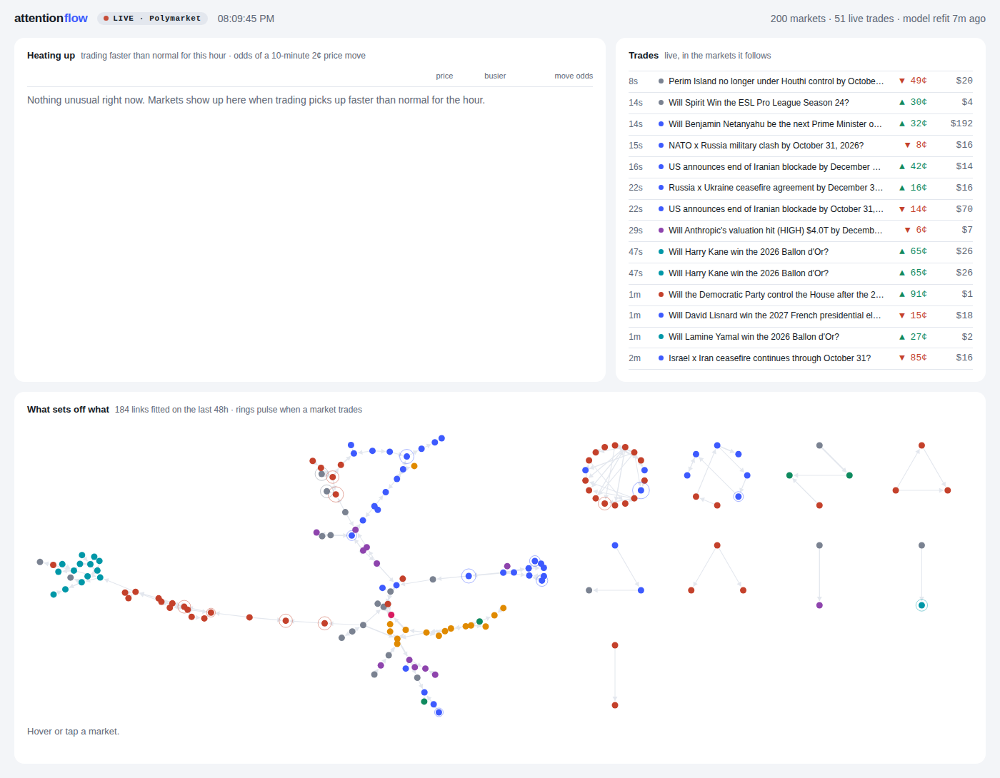

# attention flow

A live view of where traders' attention is going on [Polymarket](https://polymarket.com), and what it sets off.

It follows the busiest markets trade by trade and keeps two models fitted on the last two days:

- **Heating up:** markets trading faster than normal for the hour, with the odds of a 2¢ price move in the next 10 minutes. This is the finding that held up out of sample on months of real trades (see [Real data](#real-data)).
- **What sets off what:** which markets' trading kicks off trading in other markets, and how fast.

## Try it

You need [Go](https://go.dev/dl/) 1.24 or newer. No API keys, no accounts: everything comes from Polymarket's public endpoints.

```sh
git clone https://github.com/gauri-sharmaa/attention-flow
cd attention-flow
go run ./cmd/attnflow serve
```

Open http://localhost:8080. It spends a minute or two loading recent trades and fitting, then goes live. `-markets 60 -hours 12` warms up faster, and `-addr :9000` changes the port.



Methods follow Bacry, Mastromatteo & Muzy, [Hawkes processes in finance](https://arxiv.org/abs/1502.04592); Xu, Farajtabar & Zha, [Learning Granger causality for Hawkes processes](http://proceedings.mlr.press/v48/xuc16.pdf); and Hoffmann, Rosenbaum & Yoshida, [Estimation of the lead-lag parameter from non-synchronous data](https://arxiv.org/abs/1303.4871).

## Research commands

Go 1.24; the only dependency is a websocket library.

```sh
go build -o attnflow ./cmd/attnflow

./attnflow sim                                   # simulate 2 weeks with an answer key
./attnflow replay -truth data/sim/truth.json     # score everything
./attnflow serve                                 # live Polymarket dashboard at localhost:8080
./attnflow serve -sim                            # replay the simulator instead
./attnflow export -out site                      # static simulator dashboard for hosting

./attnflow polytrades -days 90 -closed 300 -out data/pmt90   # every trade, incl. resolved markets
./attnflow hawkes -dir data/pmt90 -folds 2       # does trading spread between markets? (walk-forward)
./attnflow hawkes -dir data/pmt90 -moves 0.02 -folds 2       # does trading predict price moves?
./attnflow leadlag -dir data/pmt90               # which prices move first
./attnflow backtest -dir data/pmt90              # paper-trade the order-flow signal
./attnflow eventstudy                            # does buzz lead trading?
./attnflow outside                               # news, Reddit, Hacker News mentions
./attnflow hawkes -extra data/pmt/outside-news.csv,data/pmt/outside-reddit.csv,data/pmt/outside-hn.csv
```

Real data (Wikipedia hourly pageviews for the topics in [data/universe.txt](data/universe.txt)):

```sh
./attnflow fetch -contact you@example.com -days 90
./attnflow replay -events data/wiki/events.csv -text data/wiki/text.json -bar 3600
./attnflow serve  -sim -events data/wiki/events.csv -text data/wiki/text.json -bar 3600 -label wikipedia
```

Any other feed (Kaito mindshare, Google Trends, attention-market prices) only needs to write the same `ts,entity,value` CSV.

## Layout

```
cmd/attnflow       CLI
internal/engine    streaming inference: factors, RLS forecasts, lead-lag graph, shocks
internal/sim       simulator with a planted answer key
internal/replay    out-of-sample scoring, oracle ceiling
internal/semantic  TF-IDF candidate graph
internal/stats     online estimators (EW, robust median/MAD, RLS)
internal/ring      lock-free SPSC queue for ingest
internal/source    Wikipedia, Polymarket, Bluesky, GDELT, Reddit, Hacker News
internal/hawkes    multivariate Hawkes processes on raw event times
internal/leadlag   Hoffmann–Rosenbaum–Yoshida lead-lag for asynchronous prices
internal/server    SSE server + dashboard
```
